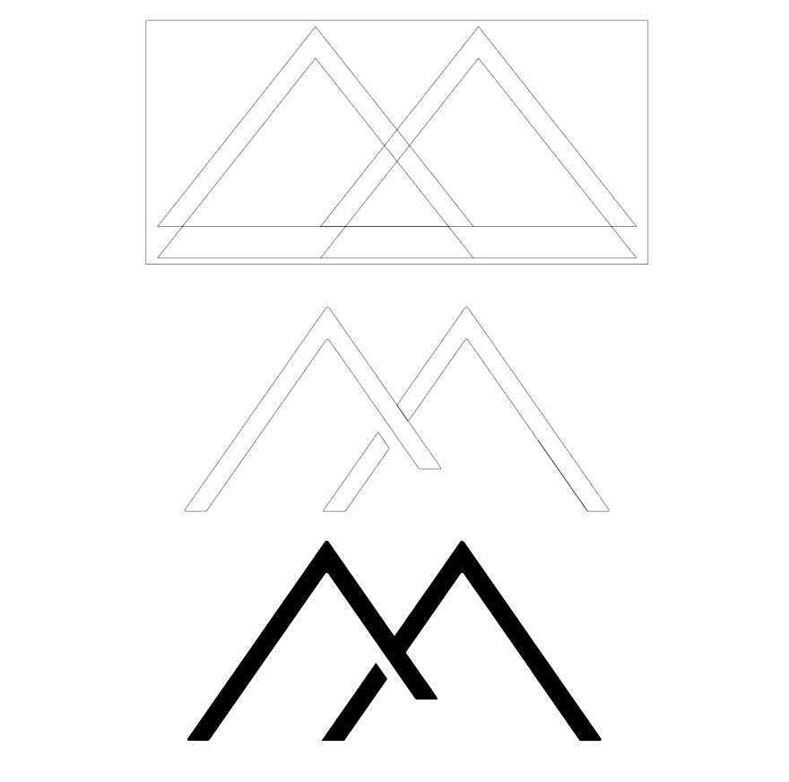
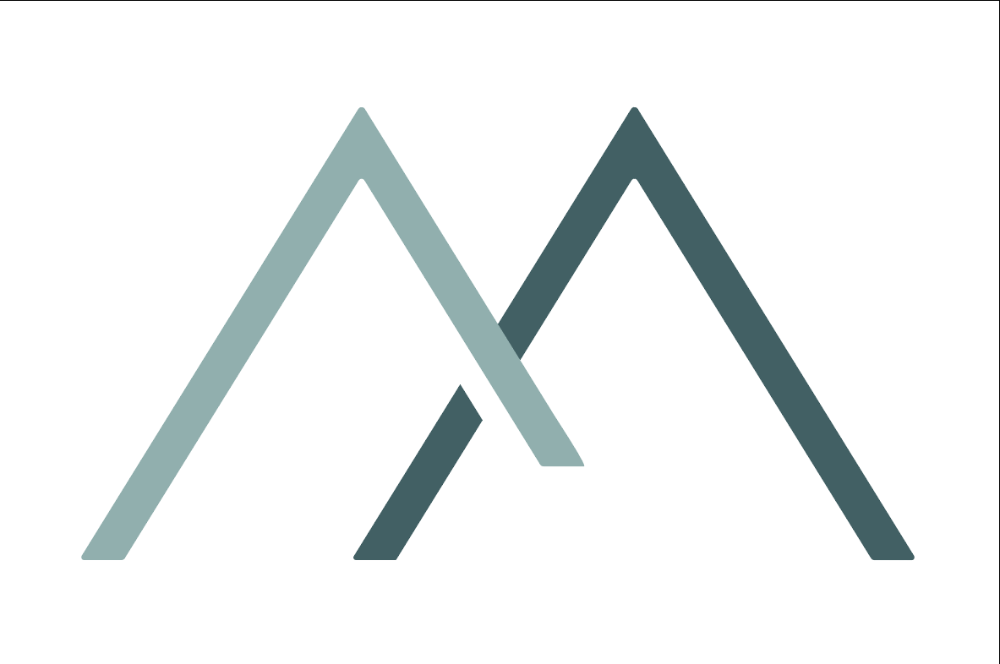
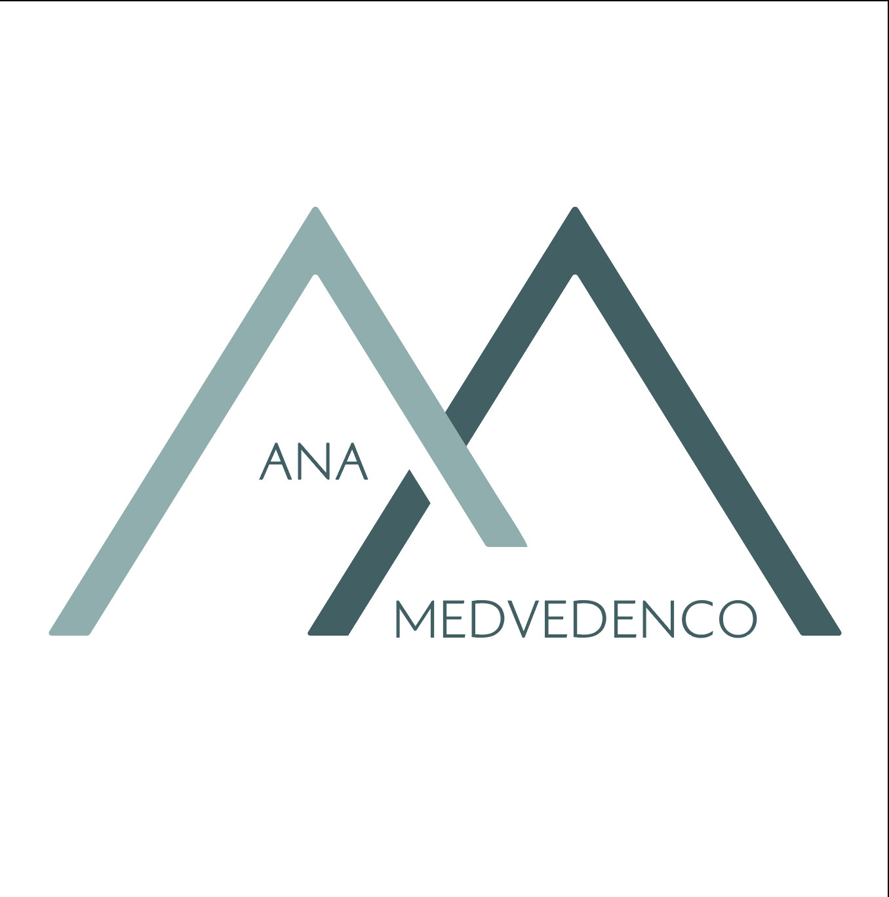
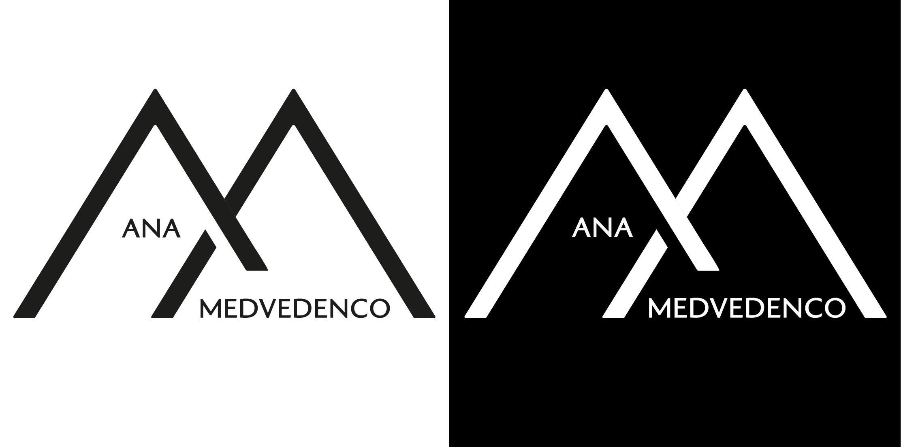
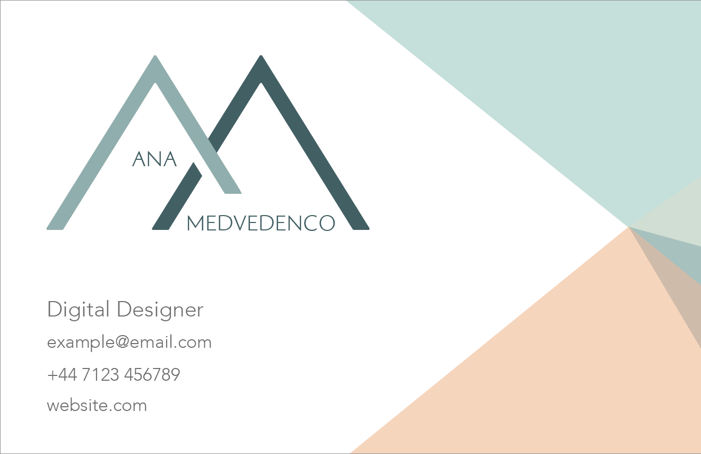
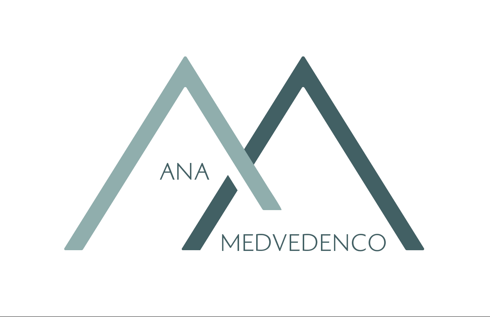
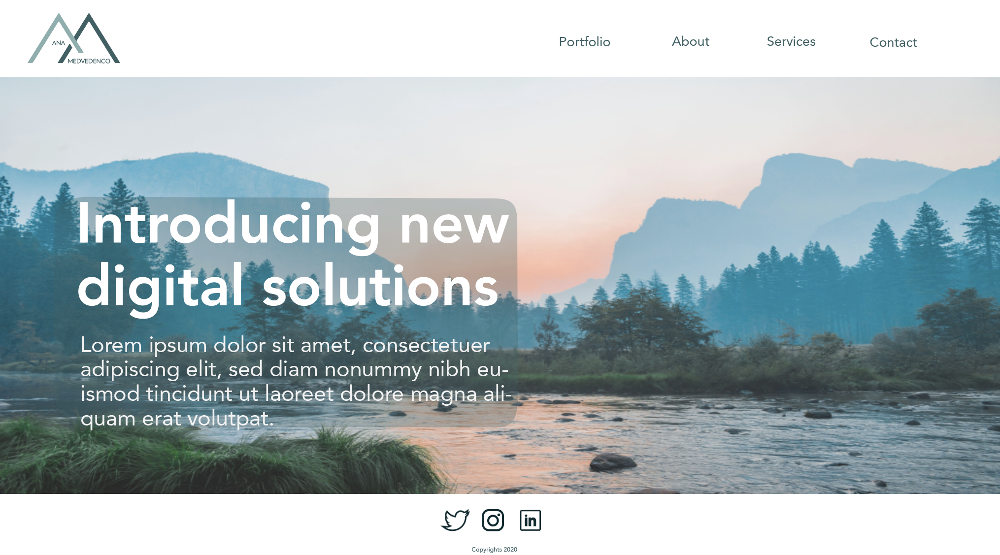

# COM420
# AE1 Assesment "Brand Yourself"
  In the modern world we are constantly facing a large amount of information about goods and services offered by various companies and professionals, and it is challenging for a digital designer to create something that will stand out of the crowd. One of the main aspects is to implement a brand that is easily recognised and is memorable. The brand represents an identity and the basic element of the visual identity is the logo. Each logo has a story behind, therefore, in the following paragraphs I will be telling the story of how my logo has been created. 

 I have opted to brand myself as a digital designer and to create a logo of my name which can potentially be used in the future career.

 When working on any other project, it is important to plan out each activity, in this instance the project has been split into few stages:

·   Research

·   Sketch

·   Feedback

·   Implement the logo idea into digital format

·   Choose colour

·   Choose font 

·   Logo variations

·   Create a business card

·   Display the logo on landing page

 

##### **Research**

I have started with a research on what represents a successful logo nowadays, all the dos and don’ts when creating a logo and what are the main points that should be considered. The main points are the physiology of the colour, proportion, appearance, visual appeal and the message that the logo represents. I have followed many social media accounts that are specialising in logo and branding designs, as well as some of famous digital designers. And what I noticed is that the simplicity is the most valued, a modern logo design is minimalist and memorable, using only a few letters or a single shape, or a shape representing a letter. According to various resources, numerous logos were created using the first letters or abbreviations, which consists in the fact that the first letter of the name of the organisation or several letters if there are several words in the name, these are then combined into a logo, in my case this would be the name initials. 

Thinking about my logo appearance, I would like for it to be modern, elegant, having easy-to-read elements, trustworthy and memorable, and after all keeping it minimalist. But the logo is not only about the appearance and design idea, but also it has to have a strategy behind. 

##### **Sketch**

Before starting to work on the computer, I have first sketched some ideas on a dotted paper as it is easier to revise and make any amendments, plus the old ideas can be revisited anytime lately. Below are shown some of the initial sketches, although there were much more ideas in my head, I eliminated them all, since the task was to simplify and give the opportunity to make it memorable. I have first thought to create a logo as AM Designs, but this name can be recognised under many other brands, therefore, to make it unique I have decided to use my full name. 

The main idea of the logo was to include both letters of my initials into a single symbol plus the full name where the screen resolution permits to do so. The symbol should be eye-catching and memorable, at the same time simple in structure. It is known that horizontal or vertical straight lines are associated with stability and tranquillity, therefore I have used straight lines and corners. 

 

##### **Feedback**

Once I have brought the variations down to two logos, I have asked five people for a feedback for each version. One of the feedbacks I have received was that one logo reminded them of some other brand, and the second one looks unique, simple and memorable. Based on each feedback received, the decision was made towards the logo I had my initial preference on, as well as some suggested amendments have been applied to it. Throughout the whole process of creation of my logo and representing it in other aspects, the feedbacks were received and appreciated. It is important to welcome any feedback especially if it is highlighting the flaws on the work done, as it helps seeing things from another angle and bringing the work to perfection. 

##### Digital format

For drawing the logo digitally, I have used Adobe Illustrator which was a new software to acknowledge. Fortunately, there are loads of resources that can help understanding the functionality of each of its tool. To transfer the logo from the sketches into digital format I have used geometrical shape such as triangles. Often geometrical shapes are used in creation of various illustrations, as it helps constructing these precisely keep the size consistent. The logo structuring process is shown below.

The logo at first sight can be associated with mountains, and the idea behind this that mountains represents achievements. That means as a digital designer the aim will be to achieve the top of the clients’ expectations. 

 

##### **Colour**

Once the structure was finalised, the next and important stage was to decide on the colours. Besides design or text, another important aspect is colour, people associate colours with certain states, objects or actions. Statistics show that all the most famous and successful logos are monochrome, using only two or three colours. If more are used then it is becoming difficult to perceive and difficult to remember. And as my logo represents initials, two colours were used – Deep Space Sparkle (#3A6165) and Drizzle (#89B0AE). These are shades of green mixed with grey. The nature of green colour has a calming effect and it is harmonious. At the same time, green colour can bring not only pacification to the design, but also a powerful charge of energy and dynamics. And all because it has an infinite number of very different and invariably beautiful shades. And grey is modern colour representing wisdom and intelligence. 

The logo should be equally well reproduced in paint or on the screen and it should work equally well in black and white colour. As well as colour version, my logo is also available in black for bright backgrounds, and white on black. Logo variations are shown below. 

 

##### **Font**

When the logo contains some text, it should have an appropriate font. Choosing the font depends on the effect we want to create. For example, if we want the logo and style to be as a whole more modern, then the font will be as similar to the sign as possible in the stylistic dimensions and in the spirit of the times. Finding the perfect font for the logo is difficult, and sometimes it takes longer than creating the logo itself. Therefore, we should always expect that we can not only select the font, but can also redraw the details of the logo, bringing it closer to the selected font. Although, I had various options for font selection, the feedback from my friends and family helped me on this decision. For the name in logo I have used the font Gaultier Light because it is simple but at the same time elegant and appropriate to the industry. This way the typeface supports the mood and the sense of time. 

 

##### **Business card**

It is know that the purpose of the business card is to deliver a person’s key contact information, but it is also believed that a percentage of successful business deals are due to the appearance of a business card. If it is poorly designed, difficult to read or its appearance associates with a different industry, chances are high that the person will never be contacted. That is why it is crucial to create a good and practical business card that will serve its purpose. When I was thinking about my business card appearance, I wanted to keep it simple, modern and for it to suggest the industry of the offered services. 

The front page includes the logo, job title and contact details such as e-mail address, phone number and the website. On the right side I have drawn some intersecting shapes and combined two other colours. One is a green shade of the logo colour pallete, despite some coolness and restraint, it attracts attention with its mystery. Also, allows me to create extremely interesting combinations with other colors, therefore the other colour I have chosen is close to peach colour. This color symbolises appreciation, closing the deal, getting together and sincerity, all perfectly combined for my card’s purpose.

The back side of the card only includes the logo on a clean white background, so in case the other person wants to leave some notes on it.

Another important aspect is to select the appropriate font, as close as possible to the font of the main logo. I have used Avenir light, as it is modern, has fine lines and combines well with the logo itself. 

 

##### **Landing page**

The logo must resist scaling, so it can be enlarged and reduced in a wide range of sizes without loss of legibility and distinctive shape. In the below example is shown how my logo can be used on a website, resizing it to a smaller format to fit in the left top corner. For the smaller screen resolution and favicon, the logo symbol will only be used, without the name. 

As this logo can be associated with two mountains, I have decided to use a mountain landscape image for the landing page. The image was found on unsplash.com and amazingly it has the colour pallete of the logo and business card altogether. The website on the desktop will include the full logo in the top left corner. On the top right there are several important links so the users will be able to access my portfolio, find more about myself, see services provided, submit a contact form and find my contact details. The body includes a general message, for which I have used Avenir Light font for body and Avenir Roman font for the heading, as these are modern, simple and clean. 

The footer of the page contains the links to follow my work on social media. It is important to create and promote social media accounts as digital designer or web developer, it can help the name and brand to become recognisable, as well as building a high reputation within the digital industry. As well as on a website or business card, this logo can be scaled to any size and printed on various marketing products. 

 

The research on this project helped a lot on finding various interesting and useful information and diving into the amazing world of digital design. Understanding the core principals of creating a logo, the story hidden behind it and the influence it can have upon a business path. A logo should evoke positive associations and not cause any negative feelings. Besides, the logo should be easily recognisable, memorable, scalable and it should be able to be placed on various media. I believe my logo is a part of all these as well as it is timeless and relevant to the digital industry. 

Check the out the outputs on Behance following this link https://www.behance.net/gallery/107951377/Personal-logo 

 

 

 

 

 

 

 

 

